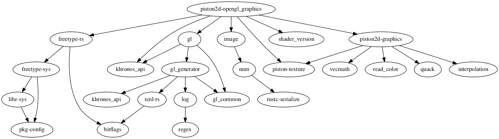

# opengl_graphics   

An OpenGL 2D back-end for the Piston game engine

Maintainers: @Potpourri, @bvssvni, @mitchmindtree

### Important!

OpenGL needs to load function pointers before use.
If you are experiencing strange error messages like "X not loaded" this is likely the case.
This is done automatically for you in the SDL2 and GLFW window back-ends for Piston.
To do this manually, see the README in [gl-rs](https://github.com/bjz/gl-rs)

## Dependencies

[How to contribute](https://github.com/PistonDevelopers/piston/blob/master/CONTRIBUTING.md)
